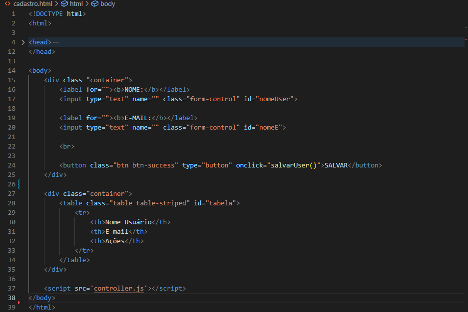
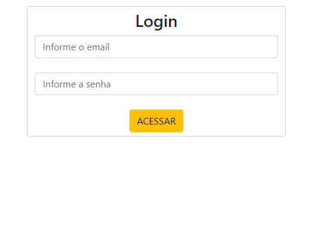
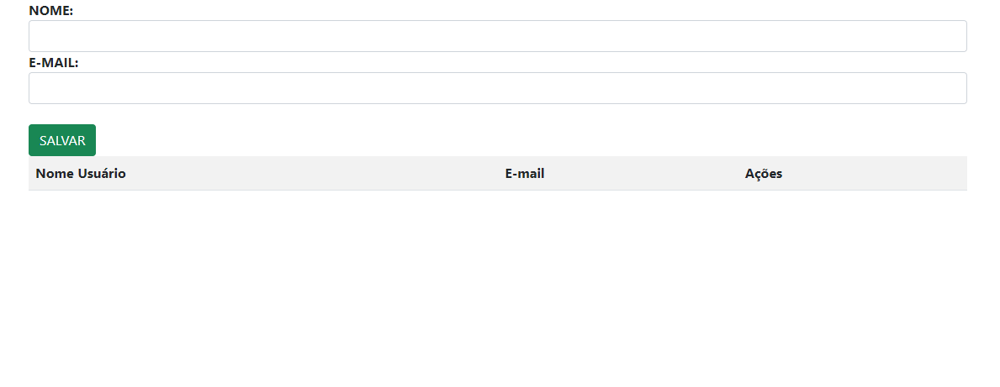
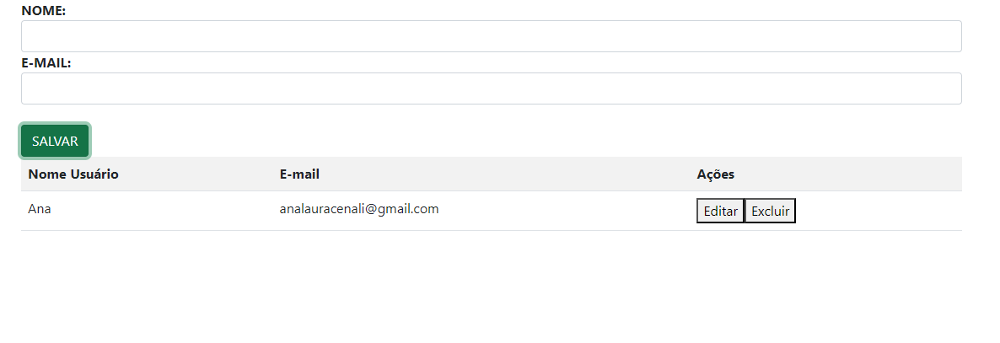

# Login Cad 🖥

## 📄 Descrição
Este projeto feito durante as aulas de Programação Web I, é um exemplo simples de um sistema de gerenciamento de usuários utilizando HTML e JavaScript. Ele permite adicionar, editar e excluir registros de usuários, com um sistema básico de validação de formulário.

## 🔗 Funcionalidades

* Login: Valida se os campos de email e senha estão preenchidos e redireciona para uma página de cadastro se estiverem.
* Cadastro de Usuários: Adiciona novos usuários à lista e atualiza a tabela exibida na página.
* Edição de Usuários: Permite editar os detalhes de um usuário selecionado.
* Exclusão de Usuários: Remove um usuário da lista e atualiza a tabela.

## 📈 Estrutura do Código
O código é composto por três funções principais:

### 1 - acessar()

* Descrição: Valida se os campos de email e senha estão preenchidos. Se ambos estiverem preenchidos, redireciona o usuário para a página cadastro.html. Caso contrário, exibe um alerta solicitando o preenchimento dos campos.

* Uso: Esta função deve ser chamada ao enviar o formulário de login.

### 2 - salvarUser()

* Descrição: Coleta o nome e e-mail inseridos pelo usuário e adiciona um novo objeto à lista dadosLista. Atualiza a tabela exibida e limpa os campos de entrada. Se algum campo estiver vazio, exibe um alerta.

* Uso: Esta função deve ser chamada ao enviar o formulário de cadastro de usuário.

### 3 - criaLista()

* Descrição: Atualiza a tabela HTML com os dados contidos em dadosLista. Adiciona uma linha para cada usuário, incluindo opções para editar e excluir.
* Uso: Esta função é chamada após adicionar, editar ou excluir um usuário para garantir que a tabela seja atualizada com os dados mais recentes.

### 4 - editar(i)

* Descrição: Preenche os campos de entrada com os dados do usuário selecionado para edição. Remove o usuário da lista e atualiza a tabela.
Parâmetro: i - O índice do usuário na lista dadosLista.
* Uso: Esta função é chamada ao clicar no botão "Editar" de um usuário na tabela.

### 5 - excluir(i)

* Descrição: Remove o usuário da lista dadosLista e atualiza a tabela.
Parâmetro: i - O índice do usuário na lista dadosLista.
* Uso: Esta função é chamada ao clicar no botão "Excluir" de um usuário na tabela.

## 🧮 Como Usar

#### 1 - Interação com o Formulário de Login

* Insira um email e uma senha válidos no formulário de login e clique em "Entrar" para ser redirecionado para a página de cadastro.

#### 2 - Cadastro de Usuários

* Preencha os campos de nome e e-mail no formulário de cadastro e clique em "Salvar". O novo usuário será adicionado à lista exibida na tabela.

#### 3 - Edição e Exclusão de Usuários

* 1 - Use os botões "Editar" e "Excluir" ao lado de cada usuário na tabela para modificar ou remover o registro.
Exemplos
Para um exemplo funcional, veja a estrutura básica de HTML e a integração com o código JavaScript:

## 📁 html

## 📍 Imagens do site 

